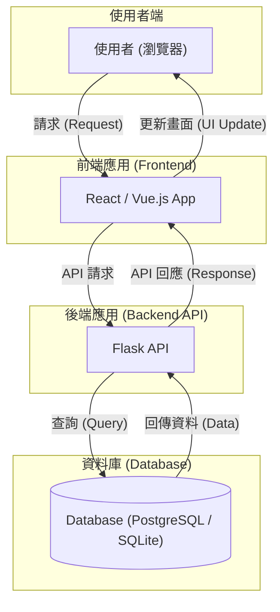

### 架構文件
- **文件標題**: 高階設計文檔 (High-Level Design)
- **文件版本**: v1.0.0
- **作者**: Gemini (軟體架構師)

---

## 1. 架構總覽 (Architecture Overview)

為了實現最大的靈活性與可擴展性，`心境軌跡 (MindTrack)` 將採用**前後端分離 (Headless)** 的現代化架構。

#### 設計原則與優勢

此架構的選擇基於以下三個核心優點：

1.  **獨立開發與部署**: 前端與後端團隊可以並行開發、測試及部署，互不阻塞。後端專注於業務邏輯與數據，前端專注於使用者體驗，大幅提升開發效率。
2.  **技術棧靈活性**: 允許我們為工作的不同部分選擇最適合的技術（例如，前端使用 React/Vue，後端使用 Python/Flask）。未來若需升級或替換某一層的技術，對另一層的影響也降至最低。
3.  **多平台擴展性**: 一套統一的後端 API 可以同時服務於目前的 Web 應用、未來的原生行動應用 (iOS/Android) 或其他第三方服務，實現一次開發、多端復用。

#### 溝通方式

-   前端與後端之間的所有通訊，將透過標準的 **RESTful API** 進行。
-   數據交換格式統一採用輕量級的 **JSON** 格式。

---

## 2. 技術選型與理由 (Technology Stack & Justification)

以下是 MVP 階段後端開發的核心技術選型：

| 技術領域     | 選擇                                  | 選擇理由 (WHY)                                                                                                                                                |
| :----------- | :------------------------------------ | :------------------------------------------------------------------------------------------------------------------------------------------------------------ |
| **Web 框架** | **Flask**                             | 輕量、靈活，擁有龐大的擴充套件生態。非常適合從 MVP 快速啟動，並能隨著業務複雜度平滑擴展。                                                                     |
| **資料庫**   | **SQLite (開發) / PostgreSQL (生產)** | **SQLite** 無需額外設定，極適合作為本地開發資料庫。**PostgreSQL** 功能強大、穩定可靠，是應對生產環境高併發與數據一致性需求的不二之選。                        |
| **ORM**      | **Flask-SQLAlchemy**                  | 作為 Flask 的官方 ORM 套件，它簡化了所有資料庫操作，能有效防止 SQL 注入攻擊，並讓我們能以 Pythonic 的方式與資料庫互動。                                       |
| **資料驗證** | **Flask-Marshmallow**                 | 提供強大的物件序列化 (Serialization) 與反序列化 (Deserialization) 功能，能輕鬆定義清晰的 API 資料結構 (Schema)，並自動完成傳入數據的驗證，確保 API 的健壯性。 |

---

## 3. 後端專案結構 (Backend Project Structure)

我們將採用 **Flask Blueprints** 來組織專案，將不同功能的程式碼（如認證、習慣管理）封裝到獨立的模組中。這能有效實現「**關注點分離 (Separation of Concerns)**」，讓專案在擴展時依然保持清晰、可維護。

```
/mindtrack-api
|-- app/                           # 核心應用程式目錄
|   |-- __init__.py                # 應用程式工廠 (App Factory)
|   |-- blueprints/                # 存放所有功能藍圖
|   |   |-- auth/                  # 處理使用者認證 (註冊、登入)
|   |   |   |-- __init__.py
|   |   |   `-- routes.py
|   |   |-- habits/                # 處理習慣與心情的增刪改查
|   |   |   |-- __init__.py
|   |   |   `-- routes.py
|   |   `-- insights/              # 處理數據洞察相關邏輯
|   |       |-- __init__.py
|   |       `-- routes.py
|   |-- models.py                  # SQLAlchemy 資料庫模型
|   |-- schemas.py                 # Marshmallow 資料驗證結構
|   `-- extensions.py              # 集中管理 Flask 擴充套件實例
|-- migrations/                    # 資料庫遷移腳本 (Alembic)
|-- tests/                         # 單元測試與整合測試
|-- config.py                      # 環境設定檔 (開發、生產)
|-- run.py                         # 應用程式啟動入口
`-- .flaskenv                      # Flask 環境變數
```

---

## 4. 高階架構圖 (High-Level Architecture Diagram)


