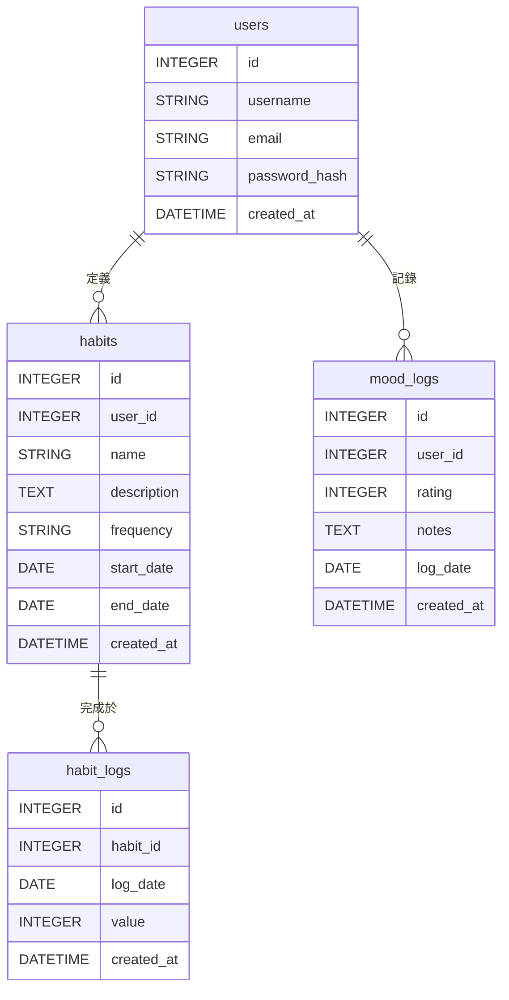

### 資料庫文件
- **文件標題**: 資料庫綱要定義文檔
- **文件版本**: v1.1.0
- **作者**: Gemini (資料庫管理員)
- **最後更新**: 2025-09-03

---

## 1. 設計原則與選型

#### 正規化 (Normalization)

本次資料庫設計嚴格遵循**第三正規化 (3NF)**。所有資料表的欄位都直接且唯一地依賴於該表的主鍵，旨在消除資料冗餘、保證數據一致性，並提升資料庫的長期可維護性。

#### 資料庫引擎

-   **選型**: **SQLite** (開發) / **PostgreSQL** (生產)
-   **選擇理由**:
    1.  **輕量級與零配置 (SQLite)**: SQLite 是一個無伺服器的資料庫引擎，直接以單一檔案形式存在，無需安裝或設定，極大地簡化了開發環境的搭建與部署流程。
    2.  **易於整合與測試**: 作為一個 C 語言函式庫，它可以輕鬆嵌入到 Python 應用程式中，非常適合專案的 MVP (最小可行性產品) 階段快速迭代與進行單元測試。

---

## 2. 資料表定義 (Table Definitions)

以下是為 `心境軌跡 (MindTrack)` 專案設計的核心資料表。

### `users` (使用者表)
- **用途說明**: 儲存應用程式的使用者帳號基本資料與憑證。

| 欄位名稱        | 資料類型 (SQLAlchemy) | 約束/索引                     | 欄位描述                               |
| :-------------- | :-------------------- | :---------------------------- | :------------------------------------- |
| `id`            | `Integer`             | `PK`, `AUTOINCREMENT`         | 使用者唯一識別碼                       |
| `username`      | `String(80)`          | `UNIQUE`, `NOT NULL`          | 使用者登入帳號                         |
| `email`         | `String(120)`         | `UNIQUE`, `NOT NULL`, `INDEX` | 使用者註冊信箱，建立索引以加速登入查詢 |
| `password_hash` | `String(256)`         | `NOT NULL`                    | 使用 bcrypt 加密後的密碼雜湊值         |
| `created_at`    | `DateTime`            | `NOT NULL`, `DEFAULT NOW`     | 帳號建立時間 (UTC)                     |

### `habits` (習慣定義表)
- **用途說明**: 儲存使用者自定義的、想要追蹤的習慣項目。

| 欄位名稱      | 資料類型 (SQLAlchemy) | 約束/索引                  | 欄位描述                                       |
| :------------ | :-------------------- | :------------------------- | :--------------------------------------------- |
| `id`          | `Integer`             | `PK`, `AUTOINCREMENT`      | 習慣唯一識別碼                                 |
| `user_id`     | `Integer`             | `FK(users.id)`, `NOT NULL` | 關聯至 `users` 表，表示該習慣的擁有者          |
| `name`        | `String(100)`         | `NOT NULL`                 | 習慣的名稱，例如「晨間運動」、「閱讀 30 分鐘」 |
| `description` | `Text`                | `NULLABLE`                 | 對習慣的詳細描述 (可選)                        |
| `frequency`   | `String(50)`          | `NOT NULL`                 | 習慣頻率，例如 "daily", "weekly"               |
| `start_date`  | `Date`                | `NULLABLE`                 | 習慣追蹤的開始日期 (可選)                      |
| `end_date`    | `Date`                | `NULLABLE`                 | 習慣追蹤的結束日期 (可選)                      |
| `created_at`  | `DateTime`            | `NOT NULL`, `DEFAULT NOW`  | 習慣建立時間 (UTC)                             |

### `habit_logs` (習慣完成紀錄表)
- **用途說明**: 記錄使用者在特定日期完成了哪個習慣，實現打卡功能。

| 欄位名稱     | 資料類型 (SQLAlchemy) | 約束/索引                    | 欄位描述                                       |
| :----------- | :-------------------- | :--------------------------- | :--------------------------------------------- |
| `id`         | `Integer`             | `PK`, `AUTOINCREMENT`        | 紀錄的唯一識別碼                               |
| `habit_id`   | `Integer`             | `FK(habits.id)`, `NOT NULL`  | 關聯至 `habits` 表，表示完成的是哪個習慣       |
| `log_date`   | `Date`                | `NOT NULL`                   | 完成習慣的日期 (`YYYY-MM-DD` 格式)             |
| `value`      | `Integer`             | `NOT NULL`, `DEFAULT 1`      | 紀錄值，預設為 1 代表「完成」                 |
| `created_at` | `DateTime`            | `NOT NULL`, `DEFAULT NOW`    | 紀錄建立時間 (UTC)                             |
|              |                       | `UNIQUE(habit_id, log_date)` | 唯一約束，確保同一個習慣一天只能打卡一次       |

### `mood_logs` (心情紀錄表)
- **用途說明**: 記錄使用者在特定日期的心情分數與相關筆記。

| 欄位名稱     | 資料類型 (SQLAlchemy) | 約束/索引                   | 欄位描述                                     |
| :----------- | :-------------------- | :-------------------------- | :------------------------------------------- |
| `id`         | `Integer`             | `PK`, `AUTOINCREMENT`       | 紀錄的唯一識別碼                             |
| `user_id`    | `Integer`             | `FK(users.id)`, `NOT NULL`  | 關聯至 `users` 表，表示該心情紀錄的擁有者    |
| `rating`     | `Integer`             | `NOT NULL`                  | 心情評分 (1-5 的整數)                        |
| `notes`      | `Text`                | `NULLABLE`                  | 對當天心情的選填文字描述                     |
| `log_date`   | `Date`                | `NOT NULL`                  | 記錄心情的日期 (`YYYY-MM-DD` 格式)           |
| `created_at` | `DateTime`            | `NOT NULL`, `DEFAULT NOW`   | 紀錄建立時間 (UTC)                           |
|              |                       | `UNIQUE(user_id, log_date)` | 唯一約束，確保一個使用者一天只能記錄一次心情 |

---

## 3. 實體關係圖 (Entity-Relationship Diagram - ERD)



## 4. 關聯文字說明

-   **users 與 habits**: 一對多 (`1-to-Many`) 關係。一個使用者可以定義多個不同的習慣。
-   **users 與 mood_logs**: 一對多 (`1-to-Many`) 關係。一個使用者可以有多筆每日心情紀錄。
-   **habits 與 habit_logs**: 一對多 (`1-to-Many`) 關係。一個已定義的習慣可以有多筆完成紀錄（每天一筆）。

---

## 5. 資料庫填充腳本 (Database Seeding Script)

以下 SQL 腳本可用於初始化資料庫並填充範例資料，方便開發與測試。

```sql
-- 清除舊資料 (可選)
DELETE FROM mood_logs;
DELETE FROM habit_logs;
DELETE FROM habits;
DELETE FROM users;

-- 填充 `users` 表
INSERT INTO users (id, username, email, password_hash, created_at) VALUES
(1, 'alice', 'alice@example.com', 'hashed_password_1', '2025-08-25 10:00:00'),
(2, 'bob', 'bob@example.com', 'hashed_password_2', '2025-08-25 10:05:00');

-- 填充 `habits` 表 (Alice 的習慣)
INSERT INTO habits (id, user_id, name, frequency, created_at) VALUES
(1, 1, '每日運動 30 分鐘', 'daily', '2025-08-25 10:10:00'),
(2, 1, '閱讀 10 頁書', 'daily', '2025-08-25 10:11:00');

-- 填充 `habits` 表 (Bob 的習慣)
INSERT INTO habits (id, user_id, name, frequency, created_at) VALUES
(3, 2, '練習冥想 15 分鐘', 'daily', '2025-08-25 10:15:00');

-- 填充 `habit_logs` 表 (打卡紀錄)
INSERT INTO habit_logs (habit_id, log_date, value, created_at) VALUES
(1, '2025-08-23', 1, '2025-08-23 20:00:00'), -- Alice 運動
(1, '2025-08-24', 1, '2025-08-24 20:05:00'), -- Alice 運動
(2, '2025-08-24', 1, '2025-08-24 22:00:00'), -- Alice 閱讀
(3, '2025-08-24', 1, '2025-08-24 08:00:00'); -- Bob 冥想

-- 填充 `mood_logs` 表
INSERT INTO mood_logs (user_id, rating, notes, log_date, created_at) VALUES
(1, 5, '運動完感覺很好！', '2025-08-23', '2025-08-23 21:00:00'),
(1, 4, '有點累，但還是讀完書了。', '2025-08-24', '2025-08-24 22:30:00'),
(2, 5, '冥想讓一天有個平靜的開始。', '2025-08-24', '2025-08-24 09:00:00');

```
