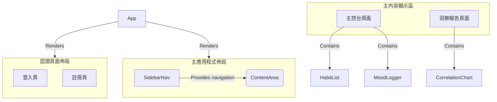

# MindTrack App - Frontend Layout & Component Breakdown

### **版本 (Version)**: `v1.0.0`

---

## 1. 總覽 (Overview)

本文件定義了「心境軌跡 (MindTrack)」應用的前端架構。它包含了宏觀的頁面佈局策略，以及遵循「原子設計 (Atomic Design)」原則的微觀元件化結構。這份藍圖旨在指導開發團隊構建一個可擴展、可維護、且與設計系統高度一致的應用程式。

## 2. 主要應用程式佈局 (Main App Layout)

### 文字描述

我們將採用一個經典且高效的儀表板 (Dashboard) 佈局。此佈局包含兩個主要部分：
1.  **固定的側邊導覽列 (Fixed Sidebar)**: 始終顯示在螢幕左側，提供對應用核心功能區（如主控台、洞察報告）的快速訪問。
2.  **主內容顯示區 (Main Content Area)**: 佔據頁面的主要空間，用於呈現當前路由對應的頁面內容。

### 設計理由 (Rationale)

使用者故事表明，使用者需要在「每日追蹤 (主控台)」和「數據洞察」之間無縫切換。一個固定的側邊導覽列提供了持續可見的導航錨點，讓使用者能隨時清晰地了解自己身在何處，並能以最少的點擊次數在不同上下文之間跳轉，完美支持了核心使用流程。

### 視覺化

## 3. 可複用元件清單 (Reusable Component Breakdown)

### 拆分原則

我們嚴格遵循原子設計 (Atomic Design) 理念，將 UI 元件拆分為三個層級：**原子 (Atoms)** 是構成 UI 的最小單位；**分子 (Molecules)** 是由原子組成的功能單元；**組織 (Organisms)** 是構成頁面的獨立區塊。

| 元件名稱 (Component Name) | 分類 (Category) | 功能描述 (Description)                                                              | 關鍵元素/所需資料 (Props)                                                                            |
| :------------------------ | :-------------- | :---------------------------------------------------------------------------------- | :--------------------------------------------------------------------------------------------------- |
| **Button**                | Atom            | 應用程式中的基礎按鈕，根據風格指南實現不同樣式。                                    | `variant: 'primary'                                                                                  | 'secondary'`, `onClick: function`, `disabled: boolean`, `children: ReactNode` |
| **Input**                 | Atom            | 基礎的文字輸入框，用於表單。                                                        | `type: 'text'                                                                                        | 'email'                                                                       | 'password'`, `value: string`, `onChange: function`, `placeholder: string`, `state: 'default' | 'error'` |
| **Label**                 | Atom            | 用於表單中，與 Input 元素關聯的標籤。                                               | `htmlFor: string`, `children: string`                                                                |
| **Heading**               | Atom            | 標題文字，對應 h1-h3。                                                              | `level: 1                                                                                            | 2                                                                             | 3`, `children: string`                                                                       |
| **Paragraph**             | Atom            | 內文或小型文字，對應 p/small。                                                      | `size: 'normal'                                                                                      | 'small'`, `children: string`                                                  |
| **Card**                  | Atom            | 帶有陰影和圓角的基礎容器，用於包裹內容區塊。                                        | `children: ReactNode`                                                                                |
| **Icon**                  | Atom            | 顯示 SVG 圖示的基礎元件。                                                           | `name: string`, `size: number`                                                                       |
| **Checkbox**              | Atom            | 一個可勾選的方塊，用於習慣打卡。                                                    | `checked: boolean`, `onChange: function`                                                             |
| **FormField**             | Molecule        | 結合 `Label`、`Input` 和錯誤訊息 `Paragraph` 的完整表單欄位。                       | `label: string`, `inputType: string`, `value: string`, `onChange: function`, `errorMessage?: string` |
| **HabitItem**             | Molecule        | 在列表中顯示單個習慣的項目，包含習慣名稱和打卡按鈕。                                | `habit: { id: string, name: string }`, `isCompleted: boolean`, `onToggle: function(id)`              |
| **MoodSelector**          | Molecule        | 由 1-5 個可點擊的 `Icon` (例如星星) 組成的心情評分元件。                            | `currentRating: number`, `onSelect: function(rating)`                                                |
| **PageHeader**            | Molecule        | 頁面頂部的標題區塊，包含一個 `Heading` 和一個可選的 `Paragraph` 副標題。            | `title: string`, `subtitle?: string`                                                                 |
| **Alert**                 | Molecule        | 用於顯示提示或錯誤訊息的區塊。                                                      | `type: 'info'                                                                                        | 'error'                                                                       | 'success'`, `message: string`                                                                |
| **LoginForm**             | Organism        | 登入表單，由多個 `FormField` 和一個提交 `Button` 組成。                             | `onLogin: function({ email, password })`, `isLoading: boolean`, `error?: string`                     |
| **RegisterForm**          | Organism        | 註冊表單，結構與 `LoginForm` 類似。                                                 | `onRegister: function({ email, password })`, `isLoading: boolean`, `error?: string`                  |
| **HabitList**             | Organism        | 顯示每日習慣列表的完整區塊，包含標題和多個 `HabitItem`。                            | `date: Date`, `habits: Array<{ id, name, isCompleted }>`, `onToggleHabit: function(id)`              |
| **MoodLogger**            | Organism        | 用於記錄當日心情的完整區塊，包含 `MoodSelector`、文字備註 `Input` 和儲存 `Button`。 | `onSaveMood: function({ rating, note })`, `todayData?: { rating, note }`                             |
| **SidebarNav**            | Organism        | 應用程式的側邊導覽列，包含指向不同頁面的連結。                                      | `activeRoute: string`                                                                                |
| **CorrelationChart**      | Organism        | 顯示心情與習慣關聯性的視覺化圖表。                                                  | `moodData: Array<{ date, score }>`, `habitData: Array<{ date, completedHabits: Array<string> }>`     |
| **OnboardingModal**       | Organism        | 首次登入時，引導使用者建立第一個習慣的彈出視窗。                                    | `onHabitCreate: function(name)`, `onClose: function`                                                 |
